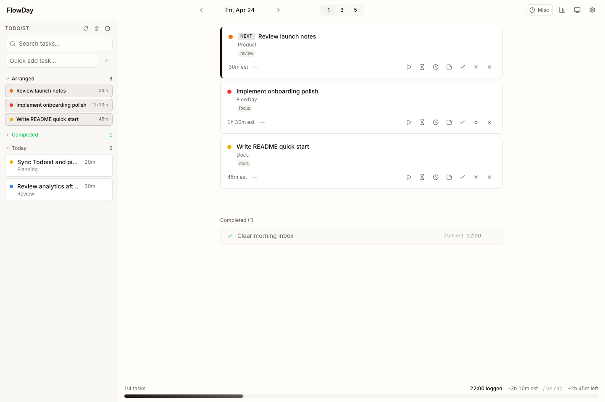
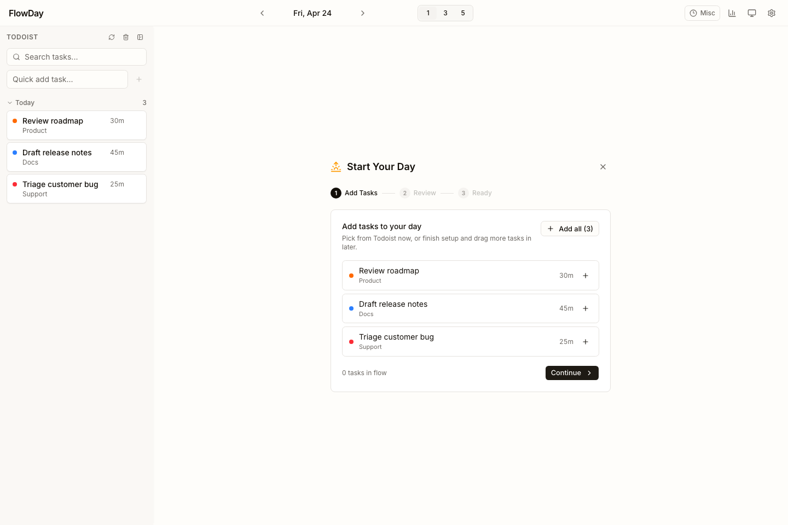
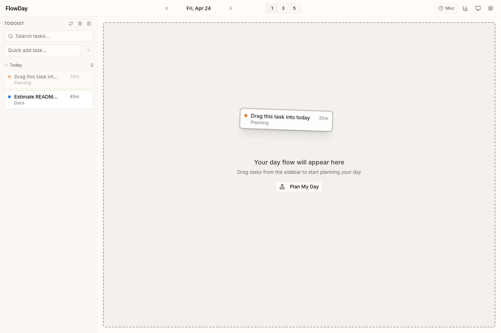
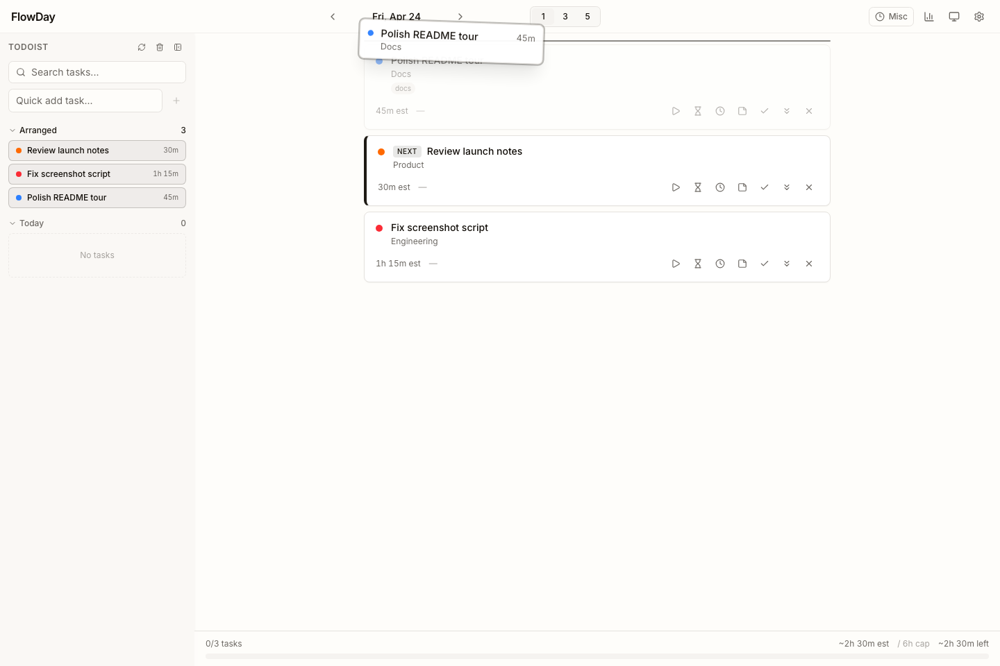
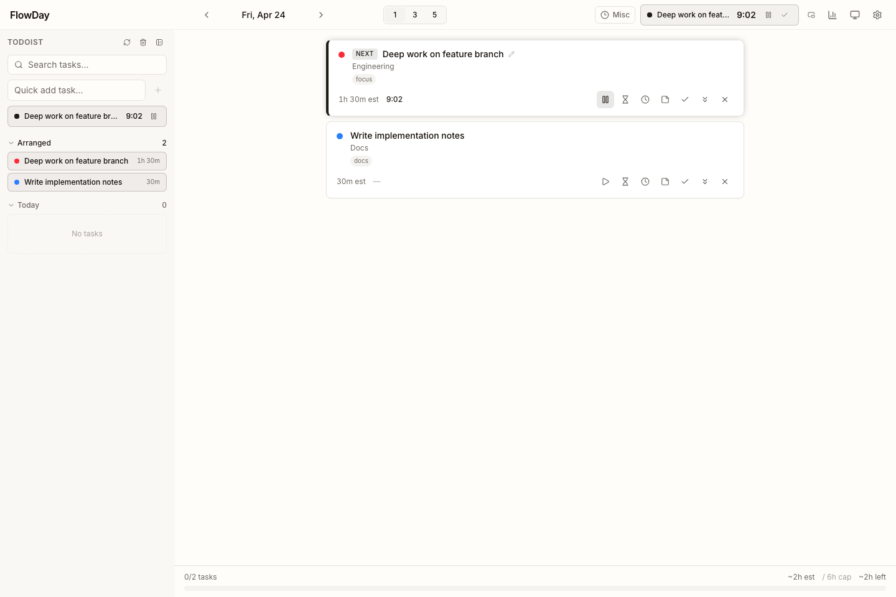
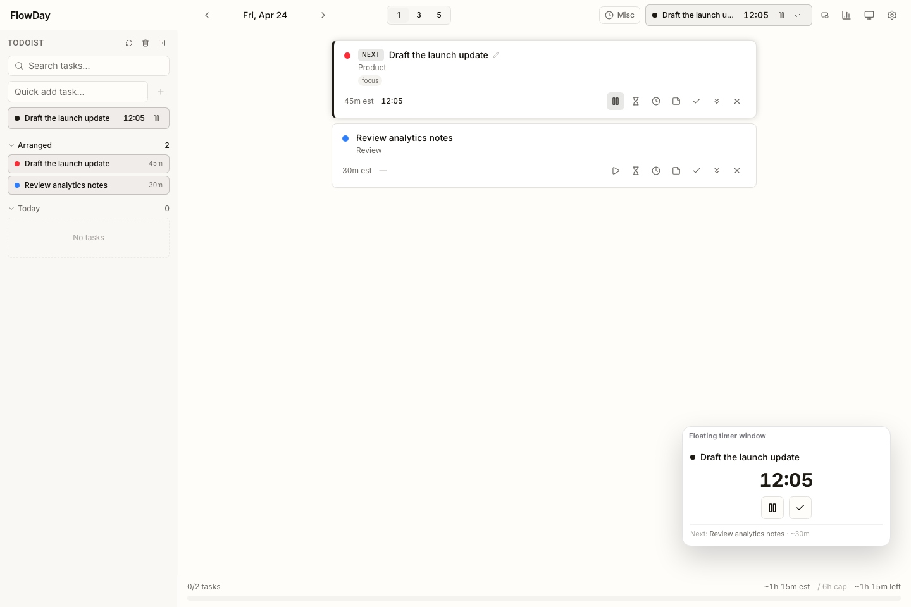
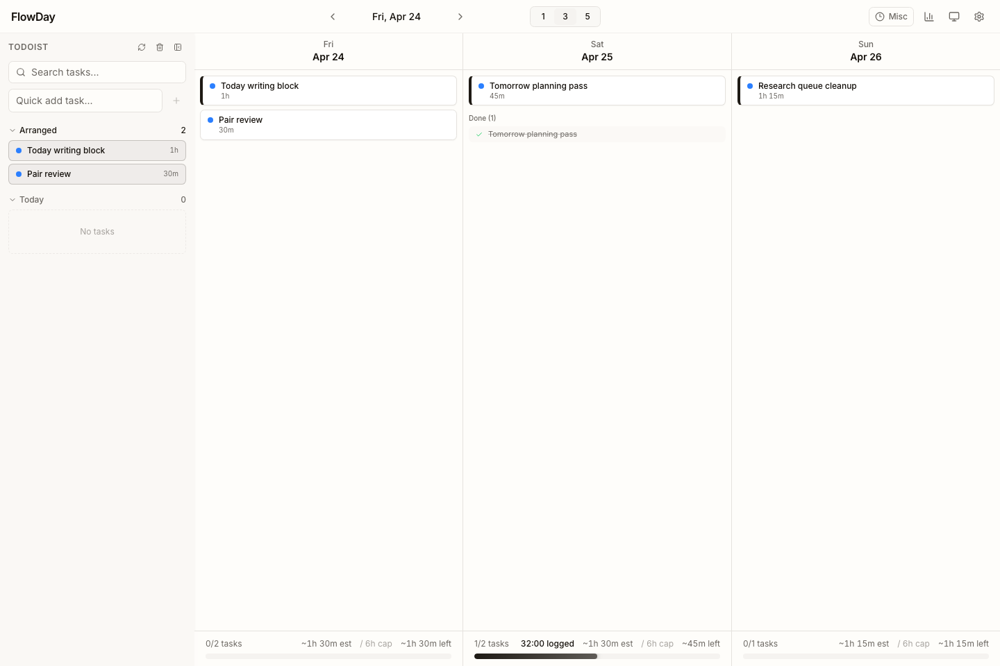
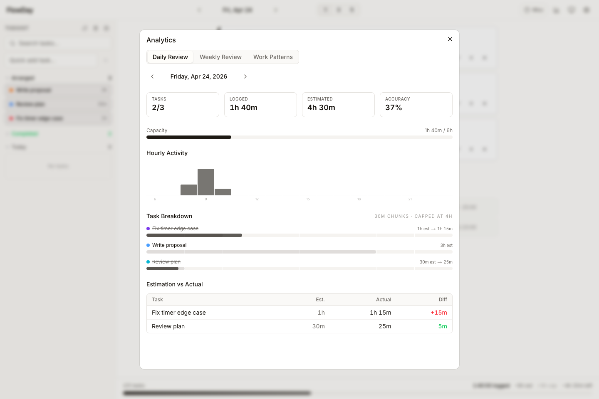

# FlowDay

<a href="https://openai.com/codex">
  
</a>

FlowDay is a simple daily execution board for solo work. Pull in your Todoist tasks, choose what belongs in today, put the work in order, then track what actually happened.

Todoist stays read-only. You can also use FlowDay without Todoist by adding local tasks directly in the sidebar.



## Try It Locally

You need Node.js 20+ and npm.

```bash
npm install
npm run dev
```

Open [http://localhost:3000](http://localhost:3000).

Important: `npm run dev` starts with `predev`, which deletes `db/flowday.db` for a clean development slate. That is useful while building, but it means local demo data does not survive dev-server restarts.

## Plan Your First Day

1. Add a local task with **Quick add task...** in the Todoist sidebar, or connect Todoist from the gear icon.
2. To connect Todoist, get an API token from [Todoist Settings > Integrations > Developer](https://todoist.com/app/settings/integrations/developer), paste it in FlowDay settings, then click **Sync Now**.
3. Drag tasks from the sidebar into the day flow, or click **Plan My Day** when the day is empty.
4. Put tasks in the order you want to work through them. Edit estimates inline so the capacity bar reflects the day you are planning.
5. Click the play icon on the next task when you start working. Pause, complete, or add manual time from the task card.
6. Use the analytics button to review the day or week, and export time entries when you need a local record.

## Core Feature Tour

### Start the day with a plan

The planning wizard helps you pick tasks, review estimates, and confirm a realistic day before you start working.



### Drag tasks into the day flow

FlowDay's main interaction is drag-and-drop: pull tasks from the sidebar into today's flow, then reorder the flow as the day changes.



### Reorder the work when priorities change

Drag one flow card before another to update the sequence. FlowDay keeps the day as an ordered queue instead of a rigid calendar.



### Work through one task at a time

Start a timer from any flow card. The active task appears in the card, sidebar, and top bar so the next action stays obvious.



### Keep a small timer window open

Pop out the active timer into a small floating window while you work in other apps. It shows the current task, elapsed time, pause/complete controls, and the next queued task.



### Check the next few days

Switch to the 3-day or 5-day view when you need planning context without turning the app into a calendar grid.



### Review what actually happened

Daily review shows completed tasks, logged time, estimate accuracy, hourly activity, and task-level breakdowns.



## Keep Your Data

FlowDay stores app data in SQLite under `db/flowday.db`.

For a persistent local container, use Docker Compose. It mounts `/app/db` to a named volume so data survives container restarts.

```bash
docker compose up -d
```

## Developer Notes

FlowDay is built with Next.js, React, TypeScript, SQLite, Drizzle, Zustand, and Tailwind/shadcn UI.

| Command | Use |
| --- | --- |
| `npm run dev` | Start local development server. Wipes `db/flowday.db` first. |
| `npm run build` | Build the production app. |
| `npm start` | Start the production server after a build. |
| `npm run lint` | Run ESLint. |
| `npm run typecheck` | Run TypeScript without emitting files. |
| `npm test` | Run the Vitest test suite. |
| `npm run test:ui` | Run Playwright UI tests. |
| `npm run test:imports` | Check refactor import boundaries. |
| `npm run screenshots:readme` | Rebuild the app, seed demo states, regenerate README screenshots, and verify image links. |
| `npm run screenshots:readme:check` | Generate README screenshots into `output/readme-screenshots/current` and compare them with the committed goldens. |

CI runs the README screenshot check on Ubuntu 24.04. The comparison keeps a small pixel-diff budget for browser and font rendering differences, while the scripted seed data, fixed date, fixed viewport, and disabled animations keep the figures stable.

For deeper product and implementation details, see [PRD/PRD.md](PRD/PRD.md). The UI test catalog lives in [PRD/UI_TEST_PLAN.md](PRD/UI_TEST_PLAN.md).
